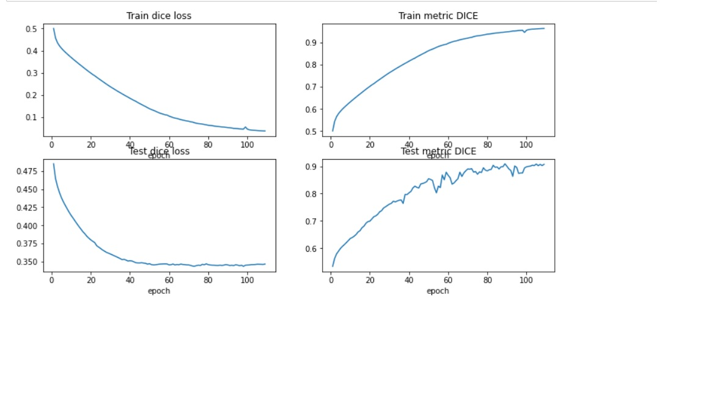
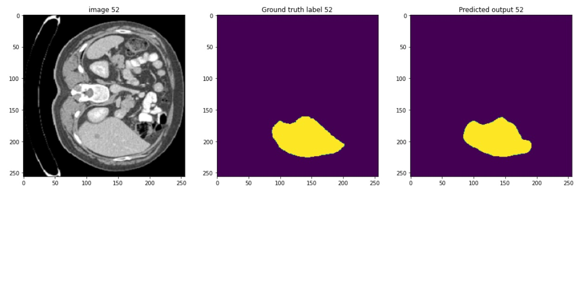

# Liver Segementation Using UNet

Aim of the Project is building a Sementic Segementation model which can identify liver in a CT ( Computed Tomography) Slice.

## Dataset

  Liver tumor Segmentation dataset contain 131 contrast-enhanced CT images provided by hospitals around the world.  After preprocessing and preparing the dataset 131 Nifti files are converted into 330 Nifti files with 64 slices in each file. [Processed Dataset](https://drive.google.com/drive/folders/1I0UWFyQ1EZGSIouMZIzP9WZQ3c7-bdmX?usp=sharing)

## Experiement

The experiment is caarried out on Nvidia's RTX 2070 Super Graphic card. The Test Dice metric for the best model is 0.89. the experiment is intended to carry out for 300 epochs, but as the model is flat lining from the epoch 80 and the model with the best metrics is found at the epoch 89.

The below figure is the output from one file.

 

## Creating the Environment and Training
> git clone https://github.com/saiprasad1586/Liver-Segementation.git
> conda env create --file environemnt.yml

Download the dataset from the above link in Dataset Section.

>Python train.py ## to train the Unet Model

Refer the [Testing.ipynb](Scripts/Testing.ipynb) to test the model on trainied model.

## References

Bilic, P., Christ, P. F., Vorontsov, E., Chlebus, G., Chen, H., Dou, Q., Fu, C.-W., Han, X., Heng, P.-A., Hesser, J., Kadoury, S., Konopczynski, T., Le, M., Li, C., Li, X., Lipkovà, J., Lowengrub, J., Meine, H., Moltz, J. H., … Menze, B. H. (2019). The Liver Tumor Segmentation Benchmark (LiTS). (Dataset)

